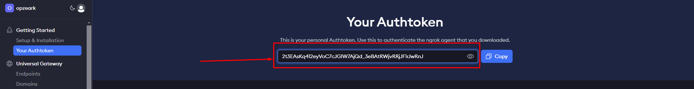
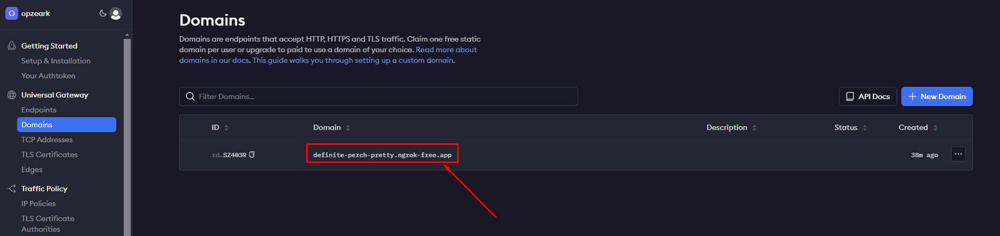

# FamMeal

> Reda Himmi, Bernard Traore, Julio Roigt, Guillaume Broutin

## Configuration

### Ngrok

Pour exposer localhost sur Internet, nous utilisons Ngrok. Il faut donc commencer par [s'inscrire](https://dashboard.ngrok.com/signup) sur le site.

Affectez ensuite la valeur de votre token à la variable `NGROK_AUTHTOKEN` dans le fichier `.env` (votre token est disponible dans la [section Authtoken](https://dashboard.ngrok.com/get-started/your-authtoken)).



Ngrok fournit un nom de domaine gratuit.

Créez-en un si ce n’est pas déjà fait dans la [section Domaine](https://dashboard.ngrok.com/domains), puis affectez le nom du domaine (xxx.ngrok-free.app) à la variable `NGROK_DOMAIN_NAME` dans le fichier `.env`.



### Ethereal

**Connectez-vous avec les identifiants suivants sur [Ethereal Mail](https://ethereal.email/login) :**
- **Email :**
- **Password :** 
## Lancement de l'application :

1. Copier le fichier d'exemple `.env` :
   ```bash
   cp .env.example .env
   ```

2. Créer votre compte Ngrok sur [Ngrok](https://ngrok.com) et [Mistral AI](https://mistral.ai/), puis récupérer votre **NGROK AUTH TOKEN**, **NGROK DOMAIN NAME** et **MISTRAL AI API KEY**.

3. Mettre à jour les variables d'environnement dans le fichier `.env` :
   ```bash
   # Ngrok config
   NGROK_AUTHTOKEN=
   NGROK_DOMAIN_NAME=

   # Cloudinary config
   CLOUDINARY_NAME=
   CLOUDINARY_KEY=
   CLOUDINARY_SECRET=

   # Mistral AI (récupérez votre clé API gratuite depuis Mistral AI)
   MISTRAL_AI_API_KEY=
   ```

4. Lancer l'application avec :
   ```bash
   quarkus dev  # ou mvn quarkus:dev
   ```
